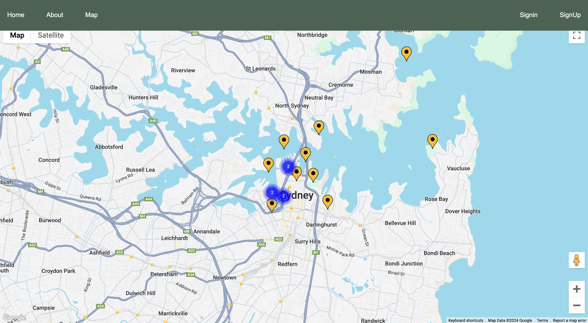

# Yard Gems Backend
Yard Gems is a proof of concept for a virtual yard sale platform that allows users to engage in virtual yard sales by placing pins on a map to represent their sale locations. The platform enables sellers to list items for sale, and buyers can browse these items by clicking on the map pins. The website is designed to offer a seamless experience for both buyers and sellers, with user-friendly front-end interfaces and a robust back-end to manage data and operations. 




#### Features:

* Interactive Home Page: Displays a spinning earth animation with options to sign up or log in and access the map.
* User Authentication: Secure registration and login functionality with role-based access (buyer/seller).
* Interactive Map: A dynamic map that shows all yard sale locations, with pins representing active sales.
* Create your own yard sale and place a pin anywhere on the map
* Click on pins anywhere in the world to view the items for sale


#### How To Get Started:

&nbsp;&nbsp;&nbsp;&nbsp;&nbsp;&nbsp;Visit: 

* Familiarize yourself with the site.
* Browse the pages in the navbar and explore the map
* Create an account to start selling items

#### Technologies Used:

##### Front End
* HTML 
* CSS 
* React 
* Google Maps API

##### Back End
* Express 
* MongoDB 
* RESTful HTTP API

```
.
├── README.md
├── controllers
│   ├── auth.js
│   ├── cart.js
│   ├── items.js
│   ├── users.js
│   └── yard-sales.js
├── db
│   └── connection.js
├── middleware
│   ├── identity-check.js
│   └── verify-token.js
├── models
│   ├── cart.js
│   ├── item.js
│   ├── user.js
│   └── yard-sale.js
├── routes
│   ├── auth.js
│   ├── cart.js
│   ├── index.js
│   ├── items.js
│   ├── users.js
│   └── yard-sales.js
├── seed
│   └── seedfile.js
└── server.js
```

#### Next Steps:

* Improve Styling
* Finish functionality for adding items to yard sales 
* Implement ability for users to comminicate and negotiate with each other
* Implmeent Stripe